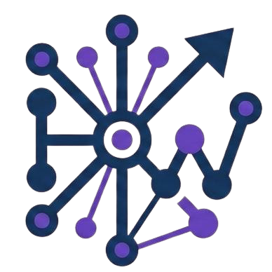

<div align="center">
  

  <h1>Club Hello World</h1>

  <p>Comunidad tecnológica de la <b>FES Aragón, UNAM</b>. Sitio público, portal de miembros y panel de administración.</p>

  <p>
    <a href="https://helloworld-unam.tech"><b>helloworld-unam.tech</b></a>
  </p>

  <p>
    
    
    
    
    <a href="LICENSE"></a>
  </p>
</div>

---

Aplicación full-stack construida con **Astro 5 (SSR)** sobre **Vercel** y **Supabase**. Cubre tres audiencias en un mismo repo: el visitante público, los miembros del club y la mesa directiva.

## Características

- Sitio público con landing animada, catálogo de eventos y ranking en vivo.
- Portal de miembros con login (Supabase OAuth), registro de evidencias con compresión de imágenes en el navegador e historial paginado.
- Panel de admin con revisión de evidencias, ajustes manuales de puntos con auditoría, cierre reversible del semestre y exportación a Excel del leaderboard.
- Flujo de selección con formulario público, agendamiento self-service de entrevistas por token y correos transaccionales vía Resend.
- Cron diario que resume pendientes a la directiva y auditoría completa en `audit_logs`.

## Stack

| | |
|---|---|
| Framework | Astro 5.7 SSR + `@astrojs/vercel/serverless` |
| Backend | Supabase (Postgres, Auth, Storage, RLS) |
| Emails | Resend |
| Reportes | ExcelJS |
| Formularios públicos | Formspree + reCAPTCHA v3 |
| Analytics | Vercel Analytics + Speed Insights |
| Estilos | CSS global — Neo-Brutalist ([`DESIGN.md`](DESIGN.md)) |

## Quick start

```bash
git clone https://github.com/Hello-World-UNAM/helloworld-web.git
cd helloworld-web
npm install
cp .env.example .env    # llenar con llaves reales
npm run dev             # http://localhost:4321
```

## Variables de entorno

| Variable | Uso |
|---|---|
| `PUBLIC_SUPABASE_URL` · `PUBLIC_SUPABASE_ANON_KEY` | Cliente Supabase (browser + server) |
| `SUPABASE_SERVICE_ROLE_KEY` | Cron. Bypasa RLS. Nunca al cliente. |
| `RESEND_API_KEY` | Correos transaccionales |
| `CRON_SECRET` | Autoriza `/api/cron/*` |

## Documentación

- [`docs/ARCHITECTURE.md`](docs/ARCHITECTURE.md) — SSR, middleware, clientes Supabase, layouts, rutas.
- [`docs/DATA_MODEL.md`](docs/DATA_MODEL.md) — tablas, RPCs, vista pública.
- [`docs/SECURITY.md`](docs/SECURITY.md) — RLS, RPCs blindadas, CSP, auditoría, reglas de GitHub.
- [`docs/DEPLOYMENT.md`](docs/DEPLOYMENT.md) — Vercel, cron, previews.
- [`docs/CONTRIBUTING.md`](docs/CONTRIBUTING.md) — convenciones, flujo de PR.
- [`DESIGN.md`](DESIGN.md) — sistema de diseño Neo-Brutalist.
- [`CLAUDE.md`](CLAUDE.md) — guía para agentes de IA.

## Origen

> **1er Hackaton Interno del Club Hello World**
> 10 de marzo de 2026 · FES Aragón, UNAM

Proyecto ganador que cimentó la identidad visual y las páginas del sitio público en HTML, CSS y JavaScript vanilla. Equipo original:

- **Ian Alejandro Lugo Flores**
- **Julian Collado Hall**
- **Obet Pérez Hernández**
- **Víctor Federico Caldera Arellano**

<sub>[Demo original](https://clubhelloworld.online/index.html) · [Repo original](https://github.com/Jules10Ch/ClubHelloWorld)</sub>

Sobre esa base se construyó la aplicación actual — Astro SSR, panel de administración, portal de miembros, flujo de selección e integración con Supabase, Resend y Vercel. Detalles en [`AUTHORS.md`](AUTHORS.md) y el [grafo de contribuidores](https://github.com/Hello-World-UNAM/helloworld-web/graphs/contributors).

## Licencia

MIT · [LICENSE](LICENSE)

---

<div align="center">
  <sub>Hecho en la <b>FES Aragón, UNAM</b> · Temporada 2026–2027</sub>
</div>
